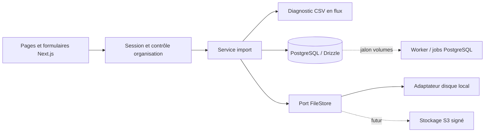

# CataMotive — vision MVP et livraison incrémentale

## État de la réalisation au 22 septembre 2026

Les jalons J1 à J5 décrits ci-dessous sont désormais implémentés dans le même MVP : CSV/XLSX, structure éditable, mapping et modèles fournisseurs, moteur de règles, jobs PostgreSQL, doublons, revue humaine, exports générique/WooCommerce/PrestaShop/Shopify/personnalisé, modèles d’export, rapport et usage. J6 est partiellement livré avec l’adaptateur S3 Supabase, les URLs signées, la rétention quotidienne et la page de paramètres. Les passages formulés au futur dans ce document conservent le plan de livraison initial ; le [rapport de vérification](VERIFICATION.md) fait foi pour l’état testé.

Le déploiement cible confirmé par les éléments fournis est **Vercel + Supabase (Francfort)**. Le dépôt GitHub `FreezyXV/CatalogDrive` est la source de déploiement. Les secrets de base et de stockage ne figurent ni dans les captures ni dans le dépôt ; leur configuration reste une opération d’environnement.

## État initial et décisions

Analyse du cahier des charges complet fourni le 22 septembre 2026. Le dossier CatalogDrive est vide, sans dépôt Git, configuration, données ou application existante. Node 23.9 et npm sont présents, ainsi que PostgreSQL 17 via Postgres.app. Aucun compte S3, service de messagerie, fournisseur d'identité ou CMS n'est configuré.

Le nom produit est **CataMotive** ; CatalogDrive reste le nom du dossier. Interface française, usage desktop prioritaire et affichage mobile utilisable. Le premier jalon est un **pilote local**, pas une mise en production du MVP complet.

## Hypothèses retenues

1. Une inscription crée un utilisateur, son organisation et son rôle propriétaire, dans une transaction. Un utilisateur appartient à une organisation au jalon 1 ; le modèle Membership prépare le multi-organisation.
2. Les fichiers fournisseurs sont confidentiels. Les lectures et écritures métier sont toujours filtrées par l'organisation de la session, jamais par un identifiant fourni par le navigateur.
3. Jalon 1 : CSV seulement, 5 Mio maximum, 50 000 lignes, 200 colonnes, 64 K caractères par enregistrement et 20 lignes d'aperçu. Les limites rendent le traitement synchrone raisonnable. Les gros fichiers nécessiteront un worker.
4. La première ligne non vide est l'en-tête au jalon 1. Les préambules, feuilles XLSX et choix manuels de structure sont reportés au jalon 2. UTF-8, UTF-16LE avec BOM et Windows-1252 sont pris en charge ; sans BOM, la détection reste une hypothèse affichée.
5. Références, codes moteur et informations véhicule restent des chaînes. Les zéros initiaux sont conservés. Aucune donnée ni correspondance véhicule/pièce n'est inventée.
6. La devise, le traitement HT/TTC, les champs obligatoires et l'identité d'un doublon seront configurables et devront être confirmés avant le moteur métier. Une référence identique de deux marques différentes n'est pas automatiquement un doublon.
7. Aucune intégration externe n'est simulée. PostgreSQL est réel ; le stockage disque est un adaptateur de développement. S3, paiement, email et CMS sont désactivés/absents tant qu'ils ne sont pas intégrés et vérifiés.
8. Les tarifs du brief sont des hypothèses commerciales, sans facturation ni promesse de quotas implicites. Le temps économisé sera une estimation documentée, jamais une mesure présentée comme certaine.

## Architecture pragmatique

Monolithe modulaire Next.js App Router + TypeScript strict. Composants serveur pour les pages privées, composants client pour les formulaires, Route Handlers pour les mutations et fichiers. Tailwind et composants UI locaux accessibles ; pas de bibliothèque complexe sans besoin.

Drizzle ORM + PostgreSQL 17, migrations SQL versionnées. Les modules `server/auth`, `server/imports`, `server/storage`, `server/db` portent les accès sensibles. Le domaine CSV est indépendant de React, testable avec Vitest. Un port `FileStore` isole la persistance binaire ; son adaptateur local réel conserve les octets originaux hors du dossier public. En production, un adaptateur S3 devra fournir URL signée, durée limitée et suppression.

Le flux HTTP est écrit par blocs avec limite réelle d'octets, puis analysé par flux. L'aperçu seul est stocké en JSONB, pas l'intégralité du catalogue en RAM. Les imports réussis, le fichier et les événements d'audit sont enregistrés dans une transaction. Une erreur supprime le fichier provisoire ; un arrêt brutal peut laisser un fichier orphelin, à traiter par une tâche de réconciliation avant production.

Authentification locale réelle : mots de passe scrypt salés, jetons de session aléatoires stockés hachés, cookie HttpOnly/SameSite, expiration, déconnexion invalidant la session, contrôle Origin pour les mutations. Pas de récupération de mot de passe fictive. En production : email vérifié, récupération, limitation distribuée, observabilité et revue de sécurité obligatoires.

## Modèle de données

Implémenté au jalon 1 :

- **User** : id, email unique, hash de mot de passe, date de création.
- **Organization** : id, nom, date de création.
- **Membership** : user_id, organization_id, rôle ; clé composée.
- **Session** : hash du jeton, user_id, organization_id, expiration ; FK vers Membership.
- **ImportJob** : id, organization_id, auteur, état analyzed, diagnostic borné, date.
- **UploadedFile** : id, organization_id, import_id, nom affiché, clé interne, taille, SHA-256 ; lien composé organisation/import.
- **AuditEvent** : organization_id, acteur, action, entity_id, date ; aucune ligne fournisseur dans les logs.

À introduire avec la fonctionnalité correspondante :

- **ImportColumn** : index stable, en-tête brut, type suggéré, champ cible, confiance (J2).
- **MappingTemplate** : fournisseur, mapping versionné et paramètres de lecture (J2).
- **TransformationRule** : identifiant/version, paramètres et portée (J3).
- **ProcessedRow** : numéro source, données brutes, données normalisées, statut et version de traitement (J3).
- **RowIssue** : champ, code, sévérité, original, suggestion, règle/version, horodatage, origine, décision et auteur (J3/J4).
- **DuplicateGroup** : membres, méthode exacte/floue, score explicable, décision (J3/J4).
- **ExportJob / ExportTemplate** : format, version, ordre, noms, encodage, séparateur, sélection, statut et clé de fichier (J4/J5).
- **UsageRecord** : lignes traitées, octets, export, clé d'idempotence (J6).

Toutes ces données métier portent `organization_id`, avec clés étrangères composées là où des relations pourraient traverser les organisations. User est global ; Membership définit les droits. Les futures tables ne sont pas créées vides pour faire croire à une fonctionnalité disponible.

Schéma normalisé cible : `supplier_reference`, `sku`, `oem_reference`, `ean`, `brand`, `product_name`, `description`, `category`, `purchase_price`, `sale_price`, `currency`, `tax_rate`, `stock_quantity`, `condition`, `manufacturer_reference`, `vehicle_information_raw`, `engine_code_raw`, `year_from_raw`, `year_to_raw`, `image_urls`, `source_row_number`, `raw_data`, `confidence_score`, `validation_status`. Les montants utiliseront decimal, pas de flottants binaires. Les scores seront des heuristiques documentées, pas des probabilités inventées.

## Pages

J1 : `/` (entrée produit honnête), `/inscription`, `/connexion`, `/dashboard` (historique et compteurs réels), `/imports/new`, `/imports/[id]` (diagnostic, aperçu et original).

J2 : `/imports/[id]/mapping`, `/templates`. J3 : `/imports/[id]/progress`, `/imports/[id]/quality`. J4 : `/imports/[id]/issues`, `/imports/[id]/export`. J5 : modèles d'export. J6 : `/pricing`, `/settings/organization`, paramètres de conservation et usage. L'historique est intégré au dashboard dès J1, puis pourra avoir sa propre page si nécessaire.

## Jalons verticaux et critères d'acceptation

### J1 — déposer et retrouver un CSV privé (cette livraison)

Parcours : inscription → organisation → dépôt CSV → diagnostic/aperçu → historique → téléchargement original → déconnexion/reconnexion.

- L'inscription persiste compte et organisation ; la connexion et la déconnexion fonctionnent réellement.
- Un CSV UTF-8, UTF-16LE BOM ou Windows-1252, séparé par virgule, point-virgule ou tabulation, est analysé. Les en-têtes, nombre de lignes, encodage supposé, séparateur et 20 premières lignes sont visibles.
- Les lignes de largeur irrégulière et en-têtes dupliqués/vides sont signalés ; les guillemets non fermés et fichiers binaires sont refusés explicitement.
- Les dépassements de taille/ligne/colonne sont refusés côté serveur ; XLSX indique clairement son indisponibilité.
- Le fichier téléchargé possède exactement le SHA-256 et les octets d'origine, y compris valeurs ressemblant à des formules. Ce téléchargement est un original non sécurisé pour un tableur, pas un export normalisé.
- L'historique survit au rechargement et à une reconnexion ; deux organisations ne peuvent consulter ni télécharger les fichiers de l'autre, même en connaissant les UUID.
- Une suppression explicite retire l'import et son fichier. Tests unitaires, intégration PostgreSQL, E2E Playwright et build réussissent.

### J2 — préparer un fichier fournisseur et réutiliser son mapping

CSV/XLSX → choix feuille/en-tête/encodage → suggestions de types/colonnes → correction → mapping enregistré → réutilisation sur un deuxième fichier.

- XLSX multi-feuilles réel, préambules et cellules texte avec zéros initiaux couverts par fixtures ; aucune formule ou macro exécutée, liens externes non suivis.
- Les collisions de mapping, colonnes manquantes et champs requis bloquent la validation avec message utile.
- Le mapping et la configuration de lecture sont versionnés, éditables, isolés par organisation et réutilisables ; les valeurs brutes restent identiques.
- L'utilisateur termine avec un aperçu standardisé exploitable ; les fichiers ZIP malveillants, expansions excessives, fichiers chiffrés et dates ambiguës sont couverts.

### J3 — obtenir un rapport de qualité explicable

Mapping validé → règles configurées → traitement → rapport → inspection des transformations.

- Au moins 10 règles testées : espaces/séparateurs de références, casse/alias de marques, format et checksum EAN, décimaux, devises, prix négatifs, stock, HTML, lignes vides, champs obligatoires, doublons exacts et probables.
- Les lignes sont séparées en valides/ambiguës/invalides ; les totaux se réconcilient sans compter deux fois une ligne.
- Toute transformation conserve original, résultat, règle/version, date et origine. Relancer une version est idempotent ; le brut n'est jamais écrasé.
- Les doublons probables indiquent méthode et score et attendent une décision humaine. Aucune correspondance automobile automatique.

### J4 — corriger et livrer un catalogue générique

Rapport → accepter/modifier/conserver/exclure → CSV configuré + rapport d'erreurs téléchargés.

- Les quatre décisions sont persistées, auditables et réversibles ; les corrections sont revalidées et le rapport recalculé.
- Choix/ordre/renommage des colonnes, séparateur et encodage fonctionnent ; les configurations se sauvegardent.
- Les lignes non résolues sont exclues par défaut et comptabilisées dans le rapport. Protection contre les formules CSV dans les exports dérivés, avec transformation expliquée.
- Jeu de test contenant accents, guillemets, sauts de ligne, formules, EAN et zéros initiaux relu sans perte attendue.

### J5 — produire des fichiers importables dans les CMS

Catalogue validé → profil WooCommerce/PrestaShop/Shopify → précontrôle → téléchargement → essai dans un CMS de test.

- WooCommerce et CSV personnalisé passent d'abord les critères MVP, puis PrestaShop et Shopify ; versions de format documentées.
- Les colonnes obligatoires, conventions de prix/stock, images et variantes sont validées sur des imports réels de test ; aucune synchronisation/API CMS prétendue.
- Un profil personnalisé peut être enregistré et réutilisé ; tout champ perdu ou incompatible est signalé avant export.

### J6 — exploiter un pilote hébergé puis ouvrir le service

Compte vérifié → import asynchrone volumineux → stockage S3 privé → export signé → consultation usage → purge.

- Worker PostgreSQL avec reprise, retries bornés, verrouillage et idempotence ; tests de crash et concurrence. Pas de Redis/Kubernetes sans justification.
- Adaptateur S3 testé sur un service réel, URLs signées expirantes et isolation ; rétention configurable et purge vérifiée, sauvegarde/restauration exercée.
- Auth durcie (email/récupération, limitation des abus), isolation revue, tests de charge, journaux structurés sans données fournisseurs, supervision et politique de confidentialité disponibles.
- Usage réel mesuré pour lignes, stockage et exports ; temps économisé identifié comme estimation. Tarifs Essai, 59/199/499 €/mois et ponctuel 199–999 € présentés selon validation commerciale ; paiement seulement si demandé et intégré réellement.
- Les 12 critères d'acceptation MVP du brief sont vérifiés avant toute qualification « production-ready ».

## Risques et mesures

| Risque                                                | Conséquence                     | Mesure / jalon                                                                  |
| ----------------------------------------------------- | ------------------------------- | ------------------------------------------------------------------------------- |
| Encodage, séparateur ou en-tête ambigu                | Décalage/perte de valeurs       | Diagnostic explicite J1, choix utilisateur J2                                   |
| Gros fichiers / ZIP bomb XLSX                         | Saturation mémoire/CPU          | Flux et limites J1 ; bornes décompression J2 ; worker J6                        |
| Faux doublons / normalisation OEM                     | Pièces fusionnées à tort        | Brut immuable, règles versionnées, validation humaine J3/J4                     |
| Formats prix HT/TTC et stock métier                   | Prix commercial erroné          | Configuration explicite et statut ambigu J3                                     |
| Fuite inter-organisations                             | Exposition de catalogues        | Session, filtres, FK composées et tests dès J1 ; revue J6                       |
| Formules CSV / HTML                                   | Exécution chez le destinataire  | Rendu React échappé J1 ; téléchargement brut signalé ; neutralisation export J4 |
| Fichier stocké sans ligne DB après crash              | Orphelins / consommation disque | Nettoyage d'erreur J1 ; réconciliation et quotas J6                             |
| Collision de corrections concurrentes                 | Décision perdue                 | Version optimiste et journal de décisions J4                                    |
| Profils CMS changeants                                | Import rejeté                   | Formats versionnés et tests réels J5                                            |
| Données véhicules non fiables / sous licence          | Promesse trompeuse              | Champs raw, aucune inférence ; connecteur futur désactivé sans source/licence   |
| Auth locale sans email ni récupération                | Compte inaccessible / abus      | Pilote local seulement ; flux vérifiés avant hébergement J6                     |
| Monétisation et retour sur investissement non validés | Offre inadaptée                 | Entretiens fournisseurs, mesure honnête ; facturation différée                  |

## Couverture intégrale du brief

Vision/cibles (1–2) : parcours fournisseur et limites métier. Périmètre/parcours (3–4) : J1 à J5. Schéma/règles (5–6) : modèle cible J2–J4. Exports (7) : J4–J5. Pages/direction artistique (8) : J1–J6. Stack/volumes (9) : monolithe et worker différé. Données (10) : entités ci-dessus. Sécurité/confidentialité (11) : socle J1, durcissement J6 ; aucune utilisation pour entraînement. Monétisation (12) : J6. Acceptation (13) : contrôles progressifs J1–J6. Méthode (14) : conception avant code, fondations puis tranche fonctionnelle ; sécurité et tests accompagnent chaque jalon.

## Sources techniques de référence

- Next.js App Router : https://nextjs.org/docs/app/getting-started/installation
- Drizzle / PostgreSQL : https://orm.drizzle.team/docs/get-started-postgresql
- Parseur CSV et options de limites : https://csv.js.org/parse/options/

Les versions réellement installées sont verrouillées dans `package-lock.json` ; ce document ne présume pas une intégration externe disponible.
